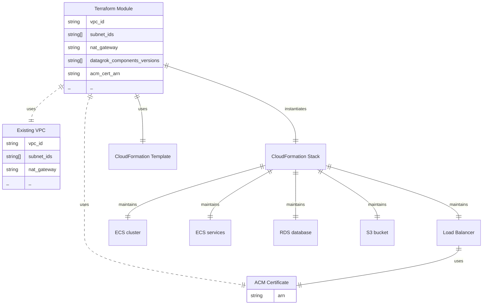

# Datagrok AWS Module

Terraform module that serves as an adapter for a CloudFormation template.
Deploys Datagrok.ai platform to AWS using AWS CloudFormation stack.

This module wraps the Datagrok CloudFormation template and provides a Terraform
interface for deployment, allowing infrastructure-as-code management of the
Datagrok platform on AWS.



## Example

```hcl
terraform {
  required_version = ">= 1.2.0"

  backend "local" {
    path = "terraform.tfstate"
  }
}

provider "aws" {
  region = "us-east-1"
}

variable "name" {
  type    = string
  default = "vpc-test"
}

variable "environment" {
  type    = string
  default = "datagrok"
}

variable "domain_name" {
  type    = string
  default = "vpc-test.datagrok.ai"
}

module "vpc" {
  source  = "terraform-aws-modules/vpc/aws"
  version = "~> 6.5"

  name = "${var.name}-${var.environment}"
  cidr = "10.0.0.0/16"

  azs             = ["us-east-1a", "us-east-1b"]
  private_subnets = ["10.0.1.0/24", "10.0.2.0/24"]
  public_subnets  = ["10.0.101.0/24", "10.0.102.0/24"]

  enable_nat_gateway               = true
  enable_vpn_gateway               = false
  single_nat_gateway               = true
  create_private_nat_gateway_route = true

  enable_dns_hostnames = true
  enable_dns_support   = true

  tags = {
    Name        = "${var.name}-${var.environment}"
    Environment = var.environment
  }
}

module "datagrok" {
  source = "../../"

  name        = var.name
  environment = var.environment

  # Network configuration
  vpc_id          = module.vpc.vpc_id
  cidr            = module.vpc.vpc_cidr_block
  subnet_ids      = module.vpc.private_subnets
  lb_subnets      = module.vpc.public_subnets
  data_subnet_ids = module.vpc.private_subnets
  nat_gateway_eip = module.vpc.nat_public_ips[0]
  s3_vpc_endpoint = ""

  # Access configuration
  internet_ingress_access          = true
  lb_access_cidr_blocks            = ["0.0.0.0/0"]
  lb_access_cidr_blocks_additional = []

  # SSL/DNS configuration
  acm_cert_arn = "arn:aws:acm:us-east-1:766822877060:certificate/ed377c38-a9ba-4b78-88b4-838203cf5f7b"

  # Service versions
  docker_datagrok_container_tag = "1.26.5"
  docker_grok_connect_tag       = "2.5.2"
  docker_grok_pipe_tag          = "1.0.1"
  docker_rabbitmq_tag           = "4.0.5-management"
  docker_grok_spawner_tag       = "1.11.4"
  docker_jkg_tag                = "1.16.2"

  # GPU configuration
  gpu_required      = false
  gpu_ami           = "/aws/service/ecs/optimized-ami/amazon-linux-2/gpu/amzn2-ami-ecs-gpu-hvm-2.0.20241017-x86_64-ebs/image_id"
  gpu_instance_type = "g4dn.xlarge"

  postfix = ""

  # IAM
  iam_role_arn = "arn:aws:iam::766822877060:role/CloudFormationExecutionRole"

  tags = {
    Terraform   = "true"
    Environment = var.environment
  }

  depends_on = [module.vpc]
}

resource "aws_route53_record" "datagrok" {
  zone_id = data.aws_route53_zone.main.zone_id
  name    = var.domain_name
  type    = "CNAME"
  ttl     = 300
  records = [module.datagrok.lb_dns_name]

  depends_on = [module.datagrok]
}

data "aws_route53_zone" "main" {
  name         = "datagrok.ai."
  private_zone = false
}

output "admin_password" {
  value = module.datagrok.admin_password
}
```

## Inputs

| Name | Description | Type | Default | Required |
|------|-------------|------|---------|:--------:|
| <a name="input_acm_cert_arn"></a> [acm\_cert\_arn](#input\_acm\_cert\_arn) | ACM certificate ARN for HTTPS | `string` | `null` | no |
| <a name="input_cidr"></a> [cidr](#input\_cidr) | VPC CIDR block to allow communication inside VPC. It will be added to security group rules for ECS services. | `string` | `"10.0.0.0/17"` | no |
| <a name="input_data_subnet_ids"></a> [data\_subnet\_ids](#input\_data\_subnet\_ids) | List of subnet IDs for data tier (RDS) | `list(string)` | n/a | yes |
| <a name="input_docker_datagrok_container_tag"></a> [docker\_datagrok\_container\_tag](#input\_docker\_datagrok\_container\_tag) | Docker tag for Datagrok container | `string` | n/a | yes |
| <a name="input_docker_grok_connect_tag"></a> [docker\_grok\_connect\_tag](#input\_docker\_grok\_connect\_tag) | Docker tag for Grok Connect container | `string` | `"2.5.2"` | no |
| <a name="input_docker_grok_pipe_tag"></a> [docker\_grok\_pipe\_tag](#input\_docker\_grok\_pipe\_tag) | Docker tag for Grok Pipe container | `string` | `"1.0.1"` | no |
| <a name="input_docker_grok_spawner_tag"></a> [docker\_grok\_spawner\_tag](#input\_docker\_grok\_spawner\_tag) | Docker tag for Grok Spawner container | `string` | `"1.11.4"` | no |
| <a name="input_docker_jkg_tag"></a> [docker\_jkg\_tag](#input\_docker\_jkg\_tag) | Docker tag for Jupyter Kernel Gateway container | `string` | `"1.16.2"` | no |
| <a name="input_docker_rabbitmq_tag"></a> [docker\_rabbitmq\_tag](#input\_docker\_rabbitmq\_tag) | Docker tag for RabbitMQ container | `string` | `"4.0.5-management"` | no |
| <a name="input_environment"></a> [environment](#input\_environment) | Environment name | `string` | n/a | yes |
| <a name="input_gpu_ami"></a> [gpu\_ami](#input\_gpu\_ami) | AMI ID for GPU instance | `string` | `"/aws/service/ecs/optimized-ami/amazon-linux-2/gpu/amzn2-ami-ecs-gpu-hvm-2.0.20241017-x86_64-ebs/image_id"` | no |
| <a name="input_gpu_instance_type"></a> [gpu\_instance\_type](#input\_gpu\_instance\_type) | Instance type for GPU instance | `string` | `"g4dn.xlarge"` | no |
| <a name="input_gpu_required"></a> [gpu\_required](#input\_gpu\_required) | Whether to provision GPU resources | `bool` | `false` | no |
| <a name="input_iam_role_arn"></a> [iam\_role\_arn](#input\_iam\_role\_arn) | IAM Role ARN for CloudFormation stack (should have IAMFullAccess and PowerUserAccess policies) | `string` | `null` | no |
| <a name="input_internet_ingress_access"></a> [internet\_ingress\_access](#input\_internet\_ingress\_access) | Whether Datagrok should be available from internet | `bool` | `true` | no |
| <a name="input_lb_access_cidr_blocks"></a> [lb\_access\_cidr\_blocks](#input\_lb\_access\_cidr\_blocks) | CIDR blocks allowed to access load balancer | `list(string)` | <pre>[<br/>  "0.0.0.0/0"<br/>]</pre> | no |
| <a name="input_lb_access_cidr_blocks_additional"></a> [lb\_access\_cidr\_blocks\_additional](#input\_lb\_access\_cidr\_blocks\_additional) | Additional CIDR blocks allowed to access load balancer | `list(string)` | `[]` | no |
| <a name="input_lb_subnets"></a> [lb\_subnets](#input\_lb\_subnets) | List of subnet IDs for load balancer | `list(string)` | n/a | yes |
| <a name="input_name"></a> [name](#input\_name) | Name prefix for resources | `string` | n/a | yes |
| <a name="input_nat_gateway_eip"></a> [nat\_gateway\_eip](#input\_nat\_gateway\_eip) | NAT Gateway EIP to allow access inside network to public load balancer | `string` | `""` | no |
| <a name="input_postfix"></a> [postfix](#input\_postfix) | URL postfix for backward compatibility (leave blank for new installations) | `string` | `""` | no |
| <a name="input_s3_vpc_endpoint"></a> [s3\_vpc\_endpoint](#input\_s3\_vpc\_endpoint) | VPC Endpoint to access Datagrok S3 bucket | `string` | `""` | no |
| <a name="input_subnet_ids"></a> [subnet\_ids](#input\_subnet\_ids) | List of subnet IDs for ECS tasks | `list(string)` | n/a | yes |
| <a name="input_tags"></a> [tags](#input\_tags) | Additional tags for resources | `map(string)` | `{}` | no |
| <a name="input_vpc_id"></a> [vpc\_id](#input\_vpc\_id) | VPC ID where resources will be created | `string` | n/a | yes |

## Outputs

| Name | Description |
|------|-------------|
| <a name="output_admin_password"></a> [admin\_password](#output\_admin\_password) | Link to admin password for first login |
| <a name="output_lb_dns_name"></a> [lb\_dns\_name](#output\_lb\_dns\_name) | Load balancer DNS name | 
